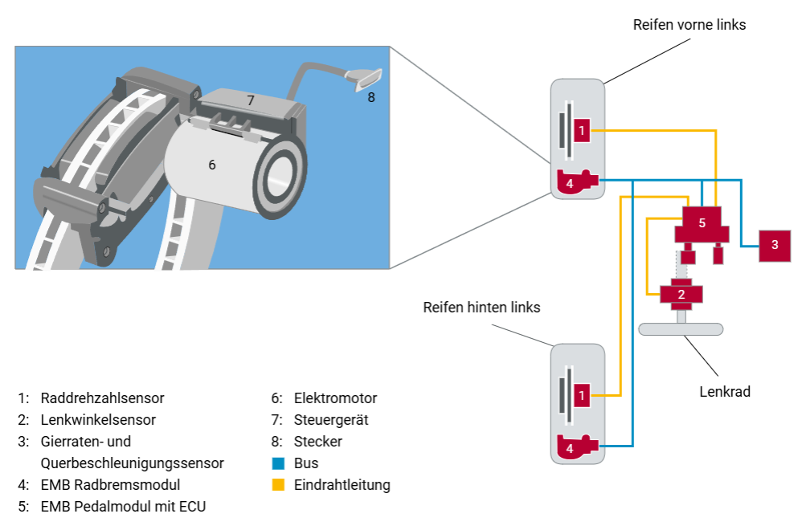

# Brake-by-Wire

Die Elektronifizierung des Automobils umfasst heute auch Bereiche, die traditionell von Mechanik und Hydraulik dominiert wurden. Mit dem Ziel, Fahrerassistenzfunktionen weiter zu verbessern, ist es notwendig, elektronische Schnittstellen zu Fahrwerkskomponenten wie Bremsanlagen und Lenkungen zu entwickeln. Diese Entwicklung hat zur Entstehung von elektrohydraulischen und elektromechanischen Bremssystemen (EMB) geführt. In diesem Tutorial werden wir den prinzipiellen Aufbau eines EMB-Systems anhand des bereitgestellten Diagramms erläutern und die zugrunde liegenden Technologien und Konzepte kritisch beleuchten.

## Elektronische Schnittstellen in Bremssystemen

Bei der elektrohydraulischen Bremse erfolgt die Betätigung der Bremssättel weiterhin hydraulisch, während bei der elektromechanischen Bremse die Bremskräfte direkt durch Elektromotoren an den Rädern erzeugt werden. Diese Elektromotoren werden von einer elektronischen Regeleinheit gesteuert, die ihre Eingaben über ein elektronisches Bremspedal mit einem Pedalgefühlssimulator erhält. Die Steuer- und Sensorsignale werden über Kommunikationsleitungen übertragen.

## Komponenten eines EMB-Systems

Basierend auf dem bereitgestellten Diagramm können wir die folgenden Hauptkomponenten eines EMB-Systems identifizieren:

1. **Raddrehzahlsensor (Rad vor links und hinten links)**:
   - Erfasst die Drehzahl der Räder und liefert wichtige Daten für das Antiblockiersystem (ABS) und die Traktionskontrolle.
2. **Lenkwinkelsensor**:
   - Misst den Lenkwinkel und unterstützt die Stabilitätskontrolle durch Anpassung der Bremskraftverteilung.
3. **Gier- und Querbeschleunigungssensor**:
   - Erfasst die Fahrzeugbewegungen und liefert Daten zur Stabilitätskontrolle und Fahrdynamikregelung.
4. **EMB Radbremsmodul**:
   - Enthält den Elektromotor (6) und die zugehörige Steuerung (7), die die Bremskräfte direkt an den Rädern erzeugen.
5. **EMB Pedalmodul mit ECU (Electronic Control Unit)**:
   - Steuert die Bremsvorgänge basierend auf den Eingaben vom elektronischen Bremspedal und den verschiedenen Sensorsignalen.
6. **Elektromotor**:
   - Erzeugt die Bremskraft direkt am Rad.
7. **Steuergerät**:
   - Koordiniert die Signale von den Sensoren und steuert die Elektromotoren zur optimalen Bremskraftverteilung.
8. **Stecker**:
   - Verbindet die verschiedenen Komponenten und ermöglicht die Kommunikation über den Bus (blaue Leitungen) und die Einzelleitungen (gelbe Leitungen).

## Brake-by-Wire

Das Konzept des Brake-by-Wire-Systems bietet mehrere Vorteile:

- **Individuelle Bremseingriffe**:
  - Verbesserte Bremsstabilität durch separate Steuerung jedes Rades.
- **Anpassung der Pedalcharakteristik**:
  - Einfach durch Softwareänderungen an den Fahrer anpassbar.
- **Verbesserte Diagnosefähigkeit**:
  - Erhöhte Betriebssicherheit durch elektronische Überwachung und Diagnose.
- **Integration in die Fahrdynamikregelung**:
  - Erhöht die aktive Sicherheit durch präzise Steuerung der Fahrzeugdynamik.

## Sicherheitsaspekte

Trotz der Vorteile stellen Brake-by-Wire-Systeme ein erhebliches Sicherheitsrisiko dar. Der Ausfall oder die Störung einer einzelnen Systemkomponente kann schwerwiegende Folgen haben. Daher müssen diese Systeme fehlertolerant ausgelegt sein. Dies bedeutet, dass die Grundbremsfunktionalität auch im Falle eines Fehlers gewährleistet sein muss, um die gesetzlichen Anforderungen zu erfüllen.

## Fazit

Die Elektronifizierung und speziell die Einführung von Brake-by-Wire-Systemen in Fahrzeugen bringt erhebliche Vorteile in Bezug auf Leistung, Anpassungsfähigkeit und Sicherheit mit sich. Gleichzeitig erfordert sie jedoch ein hohes Maß an Sicherheit und Fehlertoleranz. Durch die detaillierte Analyse der Komponenten und Funktionsweise eines EMB-Systems wird deutlich, wie komplex und gleichzeitig potenziell vorteilhaft diese Technologien sind.

Dieses Tutorial bietet einen umfassenden Überblick über die technischen Aspekte und die Bedeutung der FlexRay-Technologie in modernen Fahrzeugen. Es zeigt, dass trotz der Herausforderungen die Vorteile einer solchen Elektronifizierung erheblich sind und die Zukunft der Fahrzeugtechnik maßgeblich beeinflussen werden.
