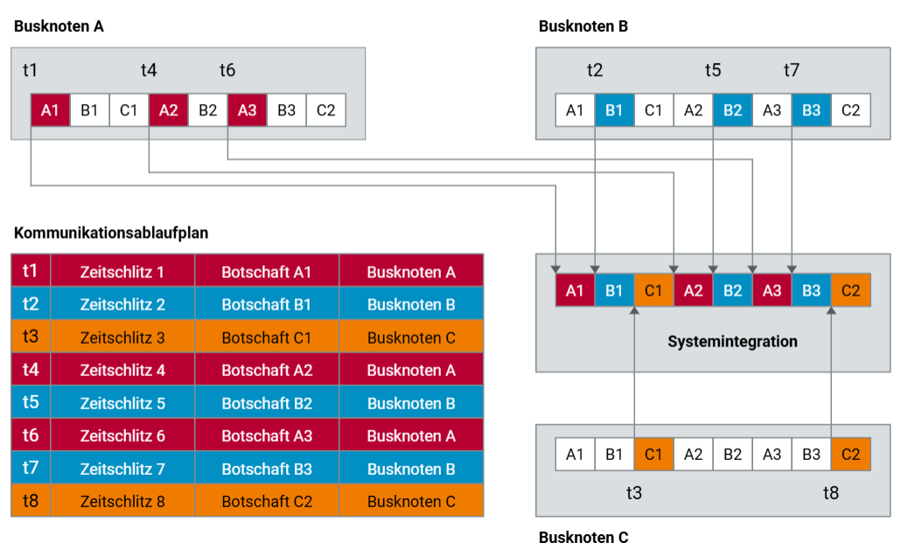

# Zusammensetzbarkeit

FlexRay ist ein Kommunikationsprotokoll, das speziell für die Anforderungen moderner Fahrzeugelektronik entwickelt wurde. Es bietet hohe Datenraten und deterministische Datenübertragung, die für sicherheitskritische Anwendungen erforderlich sind. In diesem Tutorial werden wir uns mit den Grundlagen von FlexRay, der Systemintegration und den Herausforderungen der Komplexität in der Fahrzeugelektronik beschäftigen.

## Komplexität in der Fahrzeugelektronik

Die Integration elektronischer Systeme in Fahrzeugen hat in den letzten Jahren erheblich zugenommen. Mechanische Komponenten werden zunehmend durch elektronische Systeme ersetzt, was die Komplexität und die Kosten für Tests und Systemintegration erhöht. FlexRay bietet eine Lösung für diese Herausforderungen durch seine Architektur, die eine hohe Zusammensetzbarkeit (Composability) aufweist.

### Herausforderungen der Systemintegration:

- **Erhöhte Komplexität:** Mit der Zunahme elektronischer Systeme steigen die Anforderungen an die Test- und Integrationsprozesse.
- **Kosten und Zeitaufwand:** Die aufwändigen Tests und die Integration neuer Systeme führen zu steigenden Kosten und verlängerten Entwicklungszyklen.

## Integration und Zusammensetzbare Kommunikationsarchitekturen

FlexRay ermöglicht eine Zusammensetzbare Kommunikationsarchitektur. Dies bedeutet, dass Änderungen an einem Steuergerät (ECU) keine Auswirkungen auf andere Steuergeräte oder das Gesamtsystem haben. Dadurch wird die Integration neuer Komponenten vereinfacht, da nur die betroffene Komponente getestet werden muss und nicht das gesamte System.

### Vorteile der zusammensetzbaren Architektur:

- **Reduzierter Testaufwand:** Nur die geänderten oder neuen Komponenten müssen getestet werden.
- **Stabilität des Gesamtsystems:** Andere Teile des Systems bleiben unbeeinflusst von Änderungen.

## Der FlexRay-Zeitplan

Eine wesentliche Voraussetzung für die zusammensetzbare Kommunikationsarchitektur ist ein präzise definierter Zeitplan. Dieser Zeitplan besteht aus aufeinanderfolgenden Zeitschlitzen, die jeweils bestimmten Busknoten zugeordnet sind. Jeder Zeitschlitz ist für die Übertragung einer bestimmten Nachricht reserviert und hat einen klar definierten Anfangs- und Endzeitpunkt.

### Kommunikationsablaufplan (Beispiel):

Der bereitgestellte Kommunikationsablaufplan zeigt die zeitliche Zuordnung der Nachrichtenübertragung zwischen verschiedenen Busknoten (A, B und C). Jeder Busknoten sendet und empfängt Nachrichten in vordefinierten Zeitschlitzen, wodurch ein deterministischer Kommunikationsfluss gewährleistet wird.

- **Zeitschlitz 1 (t1):** Botschaft A1 wird von Busknoten A gesendet.
- **Zeitschlitz 2 (t2):** Botschaft B1 wird von Busknoten B gesendet.
- **Zeitschlitz 3 (t3):** Botschaft C1 wird von Busknoten C gesendet.
- **Zeitschlitz 4 (t4):** Botschaft A2 wird von Busknoten A gesendet.
- **Zeitschlitz 5 (t5):** Botschaft B2 wird von Busknoten B gesendet.
- **Zeitschlitz 6 (t6):** Botschaft A3 wird von Busknoten A gesendet.
- **Zeitschlitz 7 (t7):** Botschaft B3 wird von Busknoten B gesendet.
- **Zeitschlitz 8 (t8):** Botschaft C2 wird von Busknoten C gesendet.

## Kritische Betrachtung und Zusammenfassung

Der dargestellte Kommunikationsablaufplan zeigt die Effizienz und Deterministik von FlexRay in der Systemintegration. Dennoch ist es wichtig, die Genauigkeit der Planung und die strikte Einhaltung des Zeitplans zu gewährleisten, um die Systemstabilität und -sicherheit zu garantieren. Eine potenzielle Ungenauigkeit könnte auftreten, wenn die Synchronisation zwischen den Busknoten nicht präzise erfolgt oder wenn die Zeitschlitze nicht korrekt zugewiesen werden.

Insgesamt bietet FlexRay eine robuste Lösung für die Herausforderungen der modernen Fahrzeugelektronik, indem es die Komplexität der Systemintegration reduziert und eine zuverlässige Kommunikation sicherstellt. Mit der richtigen Implementierung und Wartung kann FlexRay die Effizienz und Sicherheit in der Fahrzeugelektronik erheblich verbessern.

---

Dieses Tutorial hat die wesentlichen Aspekte von FlexRay und dessen Anwendung in der Fahrzeugelektronik behandelt. Für detaillierte technische Spezifikationen und weitere Informationen empfiehlt es sich, die offiziellen FlexRay-Spezifikationen und technische Dokumentationen der Fahrzeughersteller zu konsultieren.
